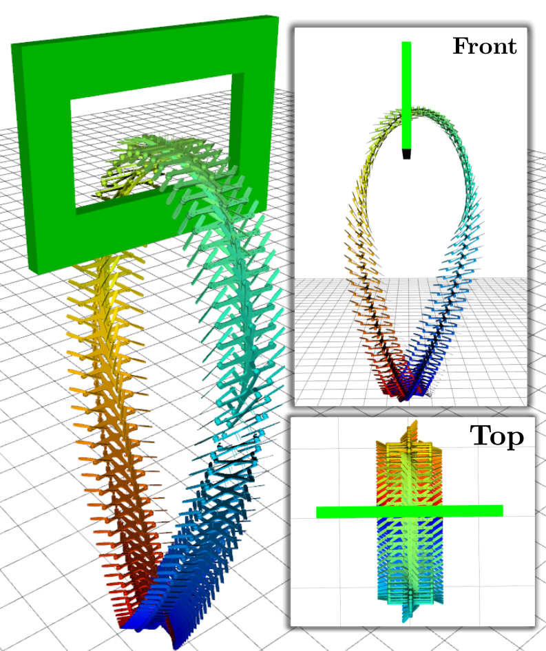
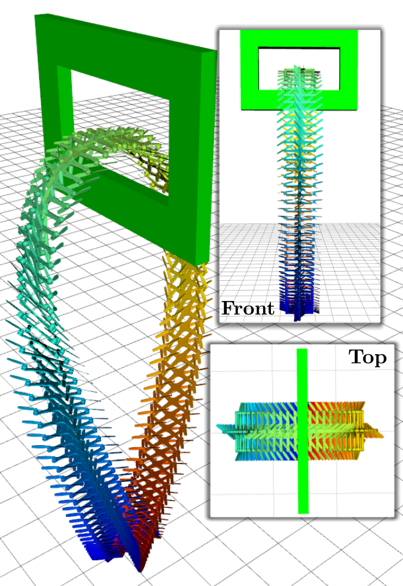
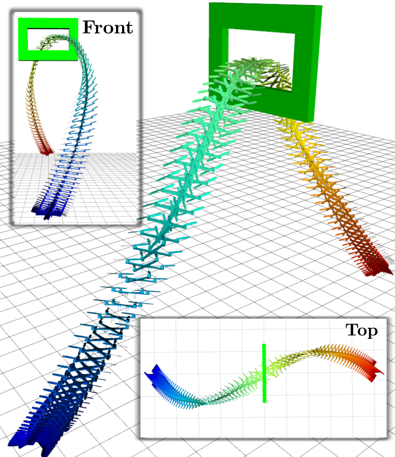
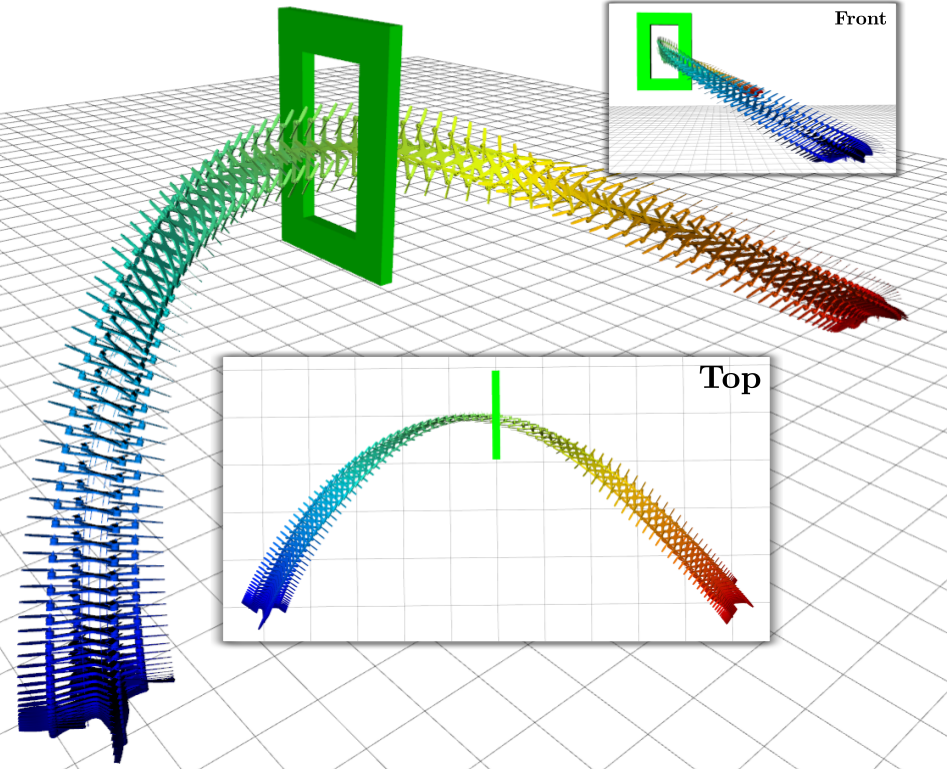

roslaunch quad_sim quad_sim.launch gazebo:=true veh:=SQ num:=01
roslaunch acl_sim sim.launch quad:=SQ01s world_name:="project_good.world"
rviz
rosrun project flipper.py __ns:=SQ01s
rosservice call /SQ01s/takeoff
rosservice call /SQ01s/flip


roslaunch acl_demos joy.launch quad:=SQ01s room:=full


# Trajectory Optimization for Multirotors using Gurobi #

Authors: Parker Lusk and Jesus Tordesillas

This repo has the coded implemented for the project of Underactuated Robotics (6.832) at MIT. 

### Introduction:
It uses an integrator model of any other, and solves the optimal control problem to minimize the input squared. The order of the input is specified by the user (Acceleration, Jerk, Snap, Crackle,... ). 


Flip in roll               |  Flip in pitch            |  Flip in roll with translation | Half-flip with translation
:-------------------------:|:-------------------------:|:-------------------------:|:-------------------------:
       |    |   |   


### Instructions:
Install [Gurobi](http://www.gurobi.com/)  

Clone this repository:
```
mkdir ws && cd ws
git clone https://github.com/jtorde/uav_trajectory_optimizer_gurobi.git
```

Source the workspace:
```
source devel/setup.bash
```


Run the ROS node:
```
rosrun project flipper.py __ns:=SQ01s
```
Open Rviz and then call one of these services:

```
rosservice call /SQ01s/line       #Straight line
rosservice call /SQ01s/flip       #Flip in roll 
rosservice call /SQ01s/flip_pitch #Flip in pitch  
rosservice call /SQ01s/flip_trans #Flip in roll with translation
rosservice call /SQ01s/window     #Half-flip with translation
```

### Use with an external simulator or harware:
This code can also be used with an external simulation, or run onboard a real UAV. 


### License
Academic license - for non-commercial use only
